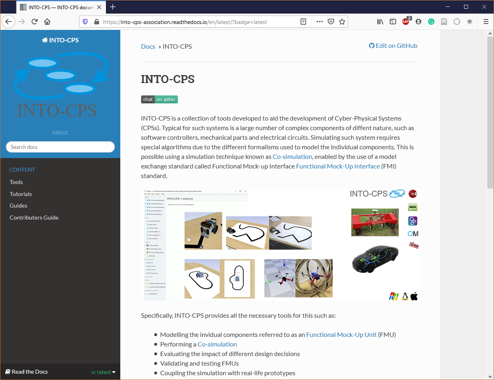

# INTO-CPS Documentation

INTO-CPS is a toolchain designed to support development of Cyber-Physical systems.
Specifically it consists of several tools centered around FMI-based co-simulation.

This documentation serves as a hub for these tools by providing:

- An overview of tools and where to download them.
- Tutorials demonstrating the combined use of the tools.
- Guides to various topics such as FMI, co-simulation, and verification.

To access the documentation press the _docs_ badge on at the top of this page or follow the link [INTO-CPS Documentation](https://into-cps-association.readthedocs.io/en/latest/).

The documentation is hosted on [Read the docs](https://readthedocs.org/) a platform that automates the build and deployment of documentation. Any updates made to this repo results in an update to the documentation.

Note that the [INTO-CPS Documentation](https://into-cps-association.readthedocs.io/en/latest/) does not try to exhaustively aggregate information for all tools. Our philosophy is that each tool should provide its own in-depth and technical documentation, which can be referred to from the [INTO-CPS Documentation](https://into-cps-association.readthedocs.io/en/latest/).

