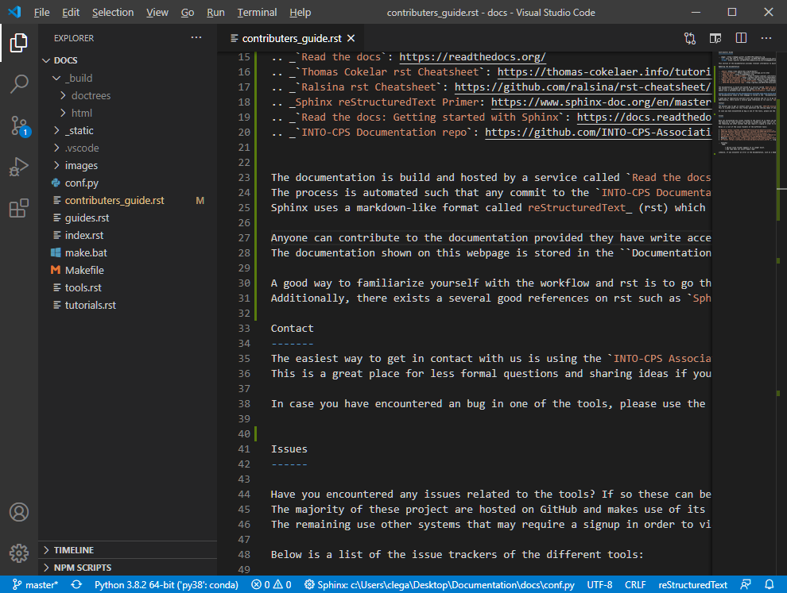

.. _contributers-guide:

Contributers Guide
==================

.. image:: https://badges.gitter.im/INTO-CPS/community.svg
   :alt: Join the chat at https://gitter.im/INTO-CPS/community?utm_source=share-link&utm_medium=link&utm_campaign=share-link
   :target: https://gitter.im/INTO-CPS/community?utm_source=badge&utm_medium=badge&utm_campaign=pr-badge

| This section of the documentation provides relevant information to maintainers and contributers of the project.
| If you are interested in becoming a contributor, please see https://into-cps.org/contact/.

Updating the documentation
--------------------------

.. _Sphinx: https://www.sphinx-doc.org/en/master/
.. _`reStructuredText`: https://docutils.sourceforge.io/rst.html
.. _`Read the docs`: https://readthedocs.org/
.. _`Thomas Cokelar rst Cheatsheet`: https://thomas-cokelaer.info/tutorials/sphinx/rest_syntax.html#id4
.. _`Ralsina rst Cheatsheet`: https://github.com/ralsina/rst-cheatsheet/blob/master/rst-cheatsheet.rst
.. _Sphinx reStructuredText Primer: https://www.sphinx-doc.org/en/master/usage/restructuredtext/index.html
.. _`Read the docs: Getting started with Sphinx`: https://docs.readthedocs.io/en/stable/intro/getting-started-with-sphinx.html
.. _`INTO-CPS Documentation repo`: https://github.com/INTO-CPS-Association/Documentation.git

The documentation is build and hosted by a service called `Read the docs`_ (rtd) which uses Sphinx_ to build html, pdf and epub documenation. 
The process is automated such that any commit to the `INTO-CPS Documentation repo`_ causes the documentation to be updated.
Sphinx uses a markdown-like format called reStructuredText_ (rst) which is suitable for creating hierarchical document structures contains cross-references.

Anyone can contribute to the documentation provided they have write access to `INTO-CPS Documentation repo`_.
The documentation shown on this webpage is stored in the ``Documentation/docs`` directory as shown below.
Of particular intrest is the ``index.rst`` and ``conf.py`` file, the former being the entry point of the documentation and the latter being the configuration used by Sphinx_.

The documentation can be build using the ``make`` command in the ``docs`` folder.

.. code-block:: bash
    
    make html # builds html docs
    make latexpdf # builds pdf
    make linkcheck # verifies links are correct

A good way to familiarize yourself with the workflow and rst is to go through `Read the docs: Getting started with Sphinx`_.
Additionally, there exists a several good references on rst such as `Sphinx reStructuredText Primer`_, `Thomas Cokelar rst Cheatsheet`_ , and `Ralsina rst Cheatsheet`_ .

Contact
-------
The easiest way to get in contact with us is using the `INTO-CPS Association Gitter channel <https://gitter.im/INTO-CPS/community?utm_source=share-link&utm_medium=link&utm_campaign=share-link>`__ or https://into-cps.org/contact/.
This is a great place for less formal questions and sharing ideas if you want to contribute.

In case you have encountered an bug in one of the tools, please use the appropriate issue tracker as listed in Issues_. 

Issues
------

Have you encountered any issues related to the tools? If so these can be submitted to the bug tracker of the respective projects.
The majority of these project are hosted on GitHub and makes use of its built-in issue tracker. 
The remaining use other systems that may require a signup in order to view and submit issues.

Below is a list of the issue trackers of the different tools:

* `Maestro <https://github.com/INTO-CPS-Association/maestro/issues>`__
* `INTO-CPS Desktop Application <https://github.com/INTO-CPS-Association/into-cps-application/issues>`__
* `Overture <https://github.com/overturetool/overture/issues>`__
* `20-sim FMU export <https://github.com/controllab/fmi-export-20sim/issues/>`__
* `OpenModelica <https://trac.openmodelica.org/OpenModelica/report>`__
*  Modelio: `general issues <https://www.modelio.org/community/bug-tracker.html>`__ and `INTO-CPS related issues <https://forge.modelio.org/projects/intocps/issues>`__ 
* `RT-Tester <https://software.verified.de/mantis?project_id=76>`__ (signup required)

.. warning::
    TODO:

        * 20-sim issue tracker appears to no longer exist.
        * DSE repo does not exist/"empty repo"

Likewise, if you encounter an error in the documentation, such as a dead link, or you have a suggestion for how to improve the documentation, please submit an issue to the `documentation issue tracker <https://github.com/INTO-CPS-Association/Documentation/issues>`__
