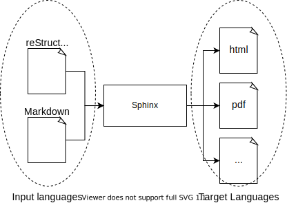
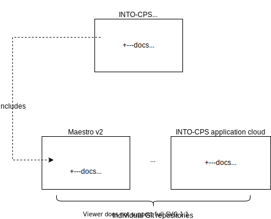
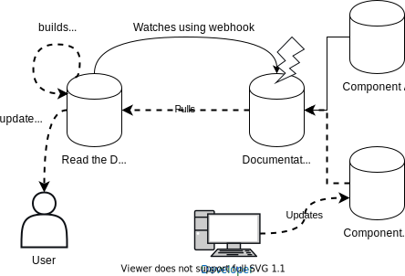

Updating the documentation
==========================

Structure of the documentation
------------------------------
The documentation is generated using `Sphinx <https://www.sphinx-doc.org/en/master/>`_ and hosted at `Read the Docs <https://readthedocs.org/>`_.
Sphinx is a tool that takes as input either reStructuredText or Markdown and produces documentation in several different formats as illustrated below:

It is recommended to use reStructuredText as an input format. 

An approach is used where the documentation of each individual component is stored inside the Git repository along with its source code.
For example the *Maestro* co-simulation engine and the desktop client *into-cps-application* are each stored in their own repository::

    https://github.com/INTO-CPS-Association/maestro.git
    https://github.com/INTO-CPS-Association/into-cps-application.git

The documentation of each module is then stored inside a folder named *docs* which each contains a top level document *index.rst*. 
The top level documentation includes the top level document of each sub-project making it possible to compile the entire documentation together.

Each component  *Git Submodules*. 

The documentation is hosted on *Read the Docs* which automatically recompiles the documentation whenever a push is made to the documentation repository.

Adding documentation to a module
--------------------------------

sphinx-quickstart

change name of conf

set theme

Building the documentation locally
----------------------------------
The easiest way to install the tool is through PyPi as follows::

    pip install sphinx

Inside the docs folder the two files *make.bat* and *Makefile* are located.
On Windows the HTML documentation can be generated by invocing the make.bat script in the docs directory as follows::

    .\make.bat html

Conversely, on Linux the *Makefile* is used in a similar way, by invoking main in the docs directory:

    make html

If successful the html documentation is generated to the _build directory.

Another good resource is the documentation is the `Getting Started with Sphinx <https://docs.readthedocs.io/en/stable/intro/getting-started-with-sphinx.html>`_ tutorial on ReadtheDocs website.

