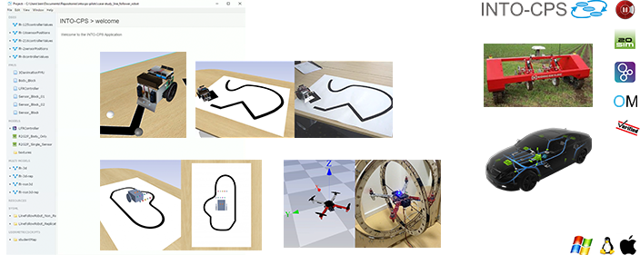

.. toctree::
    :maxdepth: 2
    :caption: Content
    :hidden:
    
    tools
    tutorials
    guides
    contributers_guide

INTO-CPS
========
.. image:: https://badges.gitter.im/INTO-CPS/community.svg
   :alt: Join the chat at https://gitter.im/INTO-CPS/community?utm_source=share-link&utm_medium=link&utm_campaign=share-link
   :target: https://gitter.im/INTO-CPS/community?utm_source=badge&utm_medium=badge&utm_campaign=pr-badge

.. INTO-CPS, is an abbreviation for "Integrated Tool Chain for Model-based Design of Cyber-Physical Systems".

INTO-CPS is a collection of tools developed to aid the development of Cyber-Physical Systems (CPSs).
Typical for such systems is a large number of complex components of diffent nature, such as software controllers, mechanical parts and electrical circuits.
Simulating such system requires special algorithms due to the different formalisms used to model the individual components.
This is possible using a simulation technique known as :ref:`cosim`, enabled by the use of a model exchange standard called Functional Mock-up Interface :ref:`fmi` (FMI) standard.

Specifically, INTO-CPS provides all the necessary tools for this such as:

   * Modelling the invidual components referred to as an :ref:`fmu` (FMU)
   * Performing a :ref:`cosim`
   * Evaluating the impact of different design decisions
   * Validating and testing FMUs
   * Coupling the simulation with real-life prototypes

A full list of the tools and how to obtain them can be found in :ref:`tools`

For a demonstration of the tools please check the `INTO-CPS Association's YouTube <https://www.youtube.com/channel/UCHfzhFYht6sKiqarjqbmtaQ>`__.

.. raw:: html

   

   <iframe width="100%" height="100%" src="https://www.youtube.com/embed/0Q47MiMFTdU" frameborder="0" allow="accelerometer; autoplay; encrypted-media; gyroscope; picture-in-picture" allowfullscreen></iframe>
   

How to use the tools?
---------------------

The :ref:`tuts` demonstrates how the different tools can be used together to model and simulate a various types of systems.

In order to use the tools effectively it may be worthwhile to read some theory on the technologies involved.
This information can be found in the :doc:`guides` section, where topics such as :ref:`cosim` and :ref:`fmi` are covered.

History and Legacy Documentation
--------------------------------

Besides the information available on the website, please see the following documents:

* :download:`The INTO-CPS Manifesto <../manifesto/INTO-CPS-Manifesto.pdf>`
* :download:`The INTO-CPS User Manual <../user_manual/INTO-CPS_toolchain_User_Manual.pdf>`
* :download:`The INTO-CPS Examples Compendium<../examples_compendium/INTO-CPS_Examples_Compendium.pdf>`
* :download:`The INTO-CPS Method Guidelines <../method_guidelines/INTO-CPS_Method_Guidelines.pdf>`

.. _Functional Mock-up Interface: https://fmi-standard.org/