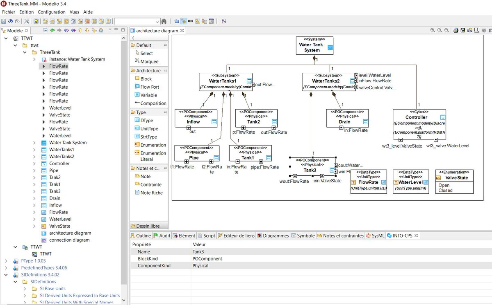
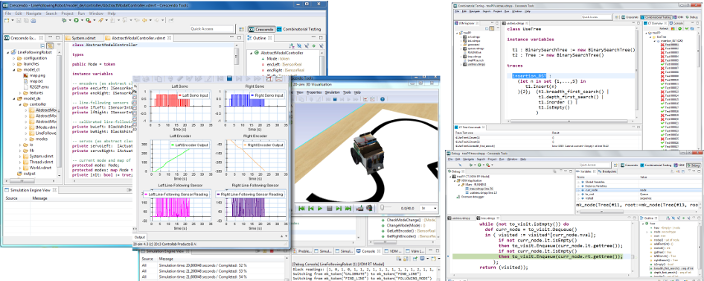
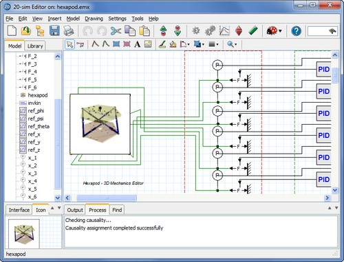
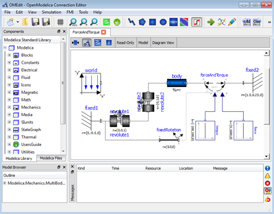
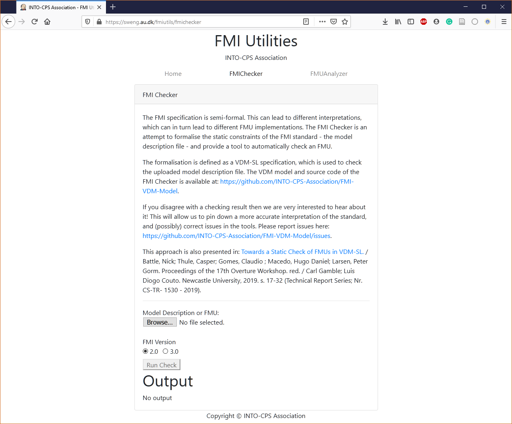

Tools
=====

The INTO-CPS toolchain consists of several tools for developing Cyber-Physical Systems.
These tools provide functionality needed to enable FMI based co-simulation namely as `Creating new FMUs`_, verify_ and `Performing Co-Simulations`_ the simulation of FMUs.
To keep the infrastructure as lightweight and flexible as possible the projects are hosted independently in their own repostories and provide standalone documentation.

A list of the tools and, grouped by the functionality they provide, can be found below:

Performing Co-Simulations
-------------------------

`INTO-CPS Desktop Application <https://into-cps-association.readthedocs.io/projects/desktop-application/en/latest/>`__
^^^^^^^^^^^^^^^^^^^^^^^^^^^^^^^^^^^^^^^^^^^^^^^^^^^^^^^^^^^^^^^^^^^^^^^^^^^^^^^^^^^^^^^^^^^^^^^^^^^^^^^^^^^^^^^^^^^^^^

The INTO-CPS Application provides a graphical user interface which can be used to configure and orchestrate co-simulation scenarios.
Install instruction are found in the application's `documentation <https://into-cps-association.readthedocs.io/projects/desktop-application/en/latest/>`__.

`INTO-CPS Cloud Application <https://github.com/INTO-CPS-Association/into-cps-application-cloud>`__
^^^^^^^^^^^^^^^^^^^^^^^^^^^^^^^^^^^^^^^^^^^^^^^^^^^^^^^^^^^^^^^^^^^^^^^^^^^^^^^^^^^^^^^^^^^^^^^^^^^

.. warning::
    Add info

`Modelio <https://www.modelio.org/>`__
^^^^^^^^^^^^^^^^^^^^^^^^^^^^^^^^^^^^^^

Modelio is a combined UML/BPMN modeler supporting a wide range of models and diagrams.
Its main features are:
    
    * SysML support integrated with UML and BPMN
    * XMI import and export
    * Scripting language support (Jython)
    * Extensibility: Modelio can be extended for any language, methodology or modeling technique just by adding modules. You can either use existing modules or else develop your own.

In addition, to its general purpose use, a special SysML profile allows Modelio to be used to setup co-simulation scenarios that can be executed within the `INTO-CPS Desktop Application`_.
For information on how to use this integration see `Desktop Application Modelio integration <https://into-cps-association.readthedocs.io/projects/desktop-application/en/latest/integrations.html#modelio>`_

`Maestro <https://github.com/INTO-CPS-Association/maestro>`__
^^^^^^^^^^^^^^^^^^^^^^^^^^^^^^^^^^^^^^^^^^^^^^^^^^^^^^^^^^^^^

Maestro is a command line tool that orchestrates co-simulation of FMUs. 
While, the program is used internally by the `INTO-CPS Desktop Application`_ it can also be downloaded and used seperately.
The `GitHub repository <https://github.com/INTO-CPS-Association/maestro>`__ which also acts as its documentation.

Creating new FMUs
-----------------

Several commercial and open-source tools exist, that are enables the creation of FMUs.
An comprehensive list of these can be found in the `tools section <https://fmi-standard.org/tools/>`_ on the FMI-standard's website.

`Overture <http://overturetool.org>`__
^^^^^^^^^^^^^^^^^^^^^^^^^^^^^^^^^^^^^^
The Overture community supports the modelling method The Vienna Development Method (VDM) which is a set of modelling techniques that have a long and successful history in both research and industrial application in the development of computer-based systems.
The Overture Tool is an open-source integrated development environment (IDE) for developing and analysing VDM models. 
The tool suite is written entirely in Java and built on top of the Eclipse platform.

By installing a plugin Overture can export its models as FMUs as described in this `pdf <http://raw.github.com/overturetool/documentation/master/documentation/UserGuideOvertureIDE/OvertureIDEUserGuide.pdf>`__ found on Overture_.

.. warning::
    the github.io page gives install instruction on the overture C generator. 
    I (chris) really dont think this is the place to give this info. 
    I suggest this information is instead added to overturetool.org

`PyFMU <https://into-cps-association.readthedocs.io/projects/pyfmu/en/develop/>`__
^^^^^^^^^^^^^^^^^^^^^^^^^^^^^^^^^^^^^^^^^^^^^^^^^^^^^^^^^^^^^^^^^^^^^^^^^^^^^^^^^^
PyFMU_ is a command line program that enables the rapid development of FMUs using Python.

`20-sim <https://www.20sim.com/>`__
^^^^^^^^^^^^^^^^^^^^^^^^^^^^^^^^^^^
20-sim is a modeling and simulation program for mechatronic systems. 
With 20-sim you can enter model graphically, similar to drawing an engineering scheme. 
With these models you can simulate and analyze the behavior of multi-domain dynamic systems and create control systems.
You can even generate C-code and run this code on hardware for rapid prototyping and HIL-simulation.

FMI support for INTO-CPS is provided using a code generation template. 

.. note::
    For 20-sim 4.5, this template can be downloaded from our `GitHub repository <https://into-cps-association.github.io/constituent-model-development/20sim.html>`__ and the installation instructions can be found in the included README file.
    Starting with 20-sim 4.6, the template is available out of the box.

`OpenModelica <https://www.openmodelica.org/>`__
^^^^^^^^^^^^^^^^^^^^^^^^^^^^^^^^^^^^^^^^^^^^^^^^
OpenModelica is an open-source Modelica-based modeling and simulation environment intended for industrial and academic usage.

The short-term goal is to develop an efficient interactive computational environment for the `Modelica <modelica.org>`__ language, as well as a rather complete implementation of the language.
It turns out that with support of appropriate tools and libraries, Modelica is very well suited as a computational language for development and execution of both low level and high level numerical algorithms, e.g. for control system design, solving nonlinear equation systems, or to develop optimization algorithms that are applied to complex applications.

The longer-term goal is to have a complete reference implementation of the Modelica language, including simulation of equation based models and additional facilities in the programming environment, as well as convenient facilities for research and experimentation in language design or other research activities. However, our goal is not to reach the level of performance and quality provided by current commercial Modelica environments that can handle large models requiring advanced analysis and optimization by the Modelica compiler.

For more information see OpenModelica `users documentation <https://openmodelica.org/useresresources/userdocumentation>`__.

.. _verify:

Verifying compliance of FMUs
----------------------------

`FMIChecker <https://github.com/INTO-CPS-Association/FMI-VDM-Model>`__
^^^^^^^^^^^^^^^^^^^^^^^^^^^^^^^^^^^^^^^^^^^^^^^^^^^^^^^^^^^^^^^^^^^^^^

To maximize compatiblity between an FMU and existing simulation tools it is import to ensure strict compliance to the FMI standard.
Unfortunately, the current situation is less that ideal, since a large portion of FMUs encountered do not implement the standard correctly.

The FMIChecker_ is a command line tool that provides thorough static check of FMUs.
Install instructions can be found on the `GitHub Repository <https://github.com/INTO-CPS-Association/FMI-VDM-Model>`__. Alternatively, the tool can be accessed at this `webpage <https://sweng.au.dk/fmiutils/fmichecker>`__, eliminating the need to install the tool. 

RT-Tester
^^^^^^^^^

`Core <https://www.verified.de/products/rt-tester/>`__
~~~~~~~~~~~~~~~~~~~~~~~~~~~~~~~~~~~~~~~~~~~~~~~~~~~~~~

RT-Tester is a test automation tool for automatic test generation, test execution and real-time test evaluation. 
Key features include a strong C/C++-based test script language, high performance multi-threading, and hard real-time capability.
The tool has been successfully applied in avionics, rail automation, and automotive test projects.

`Model Based Extension (RTT-MBT) <https://www.verified.de/products/model-based-testing/>`__
~~~~~~~~~~~~~~~~~~~~~~~~~~~~~~~~~~~~~~~~~~~~~~~~~~~~~~~~~~~~~~~~~~~~~~~~~~~~~~~~~~~~~~~~~~~

RT-Tester Model Based Test Case and Test Data Generator (RTT-MBT) supports model-based testing (MBT), that is, automated generation of test cases, test data, and test procedures from UML/SysML models.
A number of common modelling tools can be used as front-end for this.
The derived test procedures use the RT-Tester Core as a back-end, allowing the system under test to be provided on real hardware, software only, or even just simulation to aid test model development.
RTT-MBT includes requirement tracing from test models down to test executions and allows for powerful status reporting in large scale testing projects.

Interfacing with hardware (HIL)
-------------------------------

`Rabbitmq FMU <https://github.com/INTO-CPS-Association/fmu-rabbitmq>`__
^^^^^^^^^^^^^^^^^^^^^^^^^^^^^^^^^^^^^^^^^^^^^^^^^^^^^^^^^^^^^^^^^^^^^^^

`Rabbitmq FMU`_ provides a way to couple the simulation of a system to one or more components of physical system, in a process known as `hardware-in-the-loop <https://en.wikipedia.org/wiki/Hardware-in-the-loop_simulation>`__.
